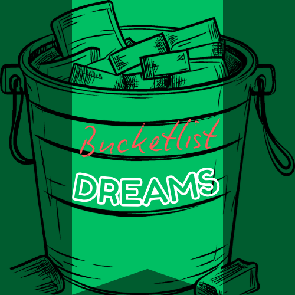

# 🌟 DreamBucket - Your Personal Bucket List App

  
   
  <em>Capture, track, and achieve your lifelong dreams</em>

## ✨ Overview

DreamBucket is a beautifully designed mobile application that helps you track and accomplish all the experiences, goals, and dreams you want to achieve in your lifetime. Keep your bucket list organized, visual, and accessible anywhere with cloud synchronization and sharing capabilities.

## 🚀 Key Features

- **Dream Management**
  - ✅ Add unlimited bucket list items with detailed descriptions
  - ✅ Mark items as complete as you achieve your dreams
  - ✅ Set price goals to help with financial planning
  - ✅ Add beautiful images to visualize your dreams

- **Organization & Discovery**
  - 🔍 Search functionality to quickly find specific dreams
  - 🏷️ Tag-based filtering system to categorize your dreams
  - 🔄 Clear filters with a single tap

- **Synchronization & Sharing**
  - ☁️ Cloud synchronization across all your devices
  - 🔒 Privacy control with option to make items private or shareable
  - 📱 Share your dreams with friends and family
  - 📷 QR code generation for easy sharing

- **User Experience**
  - 🌙 Light and dark theme support
  - 📊 Profile and progress tracking
  - 📲 Responsive design for various device sizes

## 📱 Screenshots

[Screenshots will be added here]

## 🛠️ Technical Highlights

- Built with Flutter for cross-platform compatibility
- Firebase integration for authentication and cloud storage
- Efficient state management using Provider pattern
- Optimized for performance with lazy loading and caching
- QR code generation and scanning capabilities

## 🔒 Privacy & Security

DreamBucket takes your privacy seriously. Users have complete control over which bucket list items are stored locally vs. synchronized to the cloud. The app includes privacy consent screens and settings to manage your data.

## 🔮 Coming Soon

- ✨ Social features to follow friends' bucket lists
- 📊 Progress analytics and goal tracking
- 🌐 Location-based dream suggestions
- 📅 Timeline and scheduling features

## 🤝 Contribute

Have ideas to make DreamBucket even better? Contributions are welcome! Feel free to open issues or submit pull requests.

---

  
Dream it. List it. Do it.

